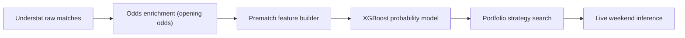

# ScorePredict

Projet de prediction foot centre sur une idee simple :

- recuperer des matchs historiques
- ajouter les cotes d'ouverture
- entrainer un modele pre-match
- comparer l'avis du modele a l'avis du marche
- ne parier que sur quelques cas tres filtres

L'ancienne strategie unitaire a ete retiree. Le depot garde maintenant uniquement le portefeuille multi-strategies encore utilise.

## En 30 secondes

Si on resume vraiment :

- le bookmaker donne deja une tres bonne estimation via les cotes
- le modele essaie de dire : "ici, la cote me parait un peu trop haute"
- on ne parie pas sur tous les matchs
- on garde seulement les matchs ou l'ecart entre modele et marche est assez fort
- au lieu d'une seule strategie, on combine plusieurs petites strategies

Le projet n'essaie donc pas de deviner tous les resultats.  
Il essaie juste de reperer quelques situations ou le marche semble legerement se tromper.

## L'idee de base

Le point cle, c'est de ne pas traiter les cotes comme un ennemi.

Les cotes sont deja une synthese enorme d'information :
- niveau des equipes
- absences
- forme recente
- perception du marche
- marge bookmaker

Donc le bon reflexe n'est pas :
- "je vais ignorer les cotes et faire mieux"

Le bon reflexe est :
- "je vais prendre les cotes comme point de depart"
- "je vais ajouter des infos foot utiles"
- "je vais regarder seulement les matchs ou mon modele n'est pas d'accord avec le marche"

## Pipeline



## D'ou viennent les donnees

- Matchs et stats : Understat
- Cotes historiques : [football-data.co.uk](https://www.football-data.co.uk/)
- Cotes live : Sportytrader via Playwright
- Cotes gardees dans le dataset : uniquement les cotes d'ouverture

Couverture actuelle :
- `21 588` matchs bruts uniques enrichis
- `21 587` matchs dans le dataset modele apres exclusion du seul match sans cotes completes
- `1 751` matchs pour `season == 2025`
- `0` match `season == 2025` sans cotes d'ouverture completes

## Structure du depot

- `Data/` : CSV bruts par equipe et saison
- `data_pipeline/` : collecte et enrichissement de la data
- `train/` : generation dataset, modele, recherche de strategies, graphes
- `inference/` : predictions live pour les matchs a venir
- `docs/` : figures utilisees dans ce README

Les fichiers importants sont :
- `data_pipeline/scrapper.py`
- `data_pipeline/market_data.py`
- `data_pipeline/enrich_data.py`
- `train/make_dataset.py`
- `train/ml_common.py`
- `train/strategy_search_common.py`
- `train/portfolio_strategy_search.py`
- `train/experimental_protocol.py`
- `train/meta_filter_protocol.py`
- `train/audit_data_quality.py`
- `train/promote_experimental_candidate.py`
- `train/validation_io.py`
- `train/clv_io.py`
- `train/clv_metrics.py`
- `train/validation_metrics.py`
- `train/validation_context.py`
- `train/validation_verdict.py`
- `train/validation_markdown.py`
- `train/scientific_validation_report.py`
- `train/run_positive_strategy_portfolio.ps1`
- `train/run_experimental_protocol.ps1`
- `train/run_model_benchmark_protocol.ps1`
- `train/run_rule_based_protocol.ps1`
- `train/run_clv_timing_filter_protocol.ps1`
- `train/run_meta_filter_protocol.ps1`
- `train/run_data_quality_audit.ps1`
- `train/run_scientific_validation.ps1`
- `train/generate_readme_figures.py`
- `inference/portfolio_presets.py`
- `inference/live_tracking.py`
- `inference/fetch_sportytrader_portfolio_odds.py`
- `inference/predict_upcoming_portfolio.py`
- `inference/upcoming_portfolio_strategy.py`
- `inference/evaluate_live_portfolio.py`
- `inference/run_upcoming_portfolio.ps1`
- `inference/run_weekend_predictions.ps1`
- `inference/run_live_evaluation.ps1`

## Ce que fait le modele, concretement

Le modele donne 3 probabilites pour chaque match :
- victoire domicile
- nul
- victoire exterieur

Le marche donne aussi son avis via les cotes.

Exemple simple :
- si la cote du nul est `4.00`, le marche dit en gros "le nul a autour de 25% de chances", avant correction de marge
- si le modele pense plutot `32%`
- alors il y a un ecart

Cet ecart ne suffit pas tout seul.
On regarde aussi :
- si l'esperance est positive
- si la cote est dans une plage interessante
- si le pari correspond a une strategie deja retenue

## Comment une decision est prise

Version tres simple :

1. Le modele regarde un match avant qu'il commence.
2. Il donne 3 probabilites :
- domicile
- nul
- exterieur
3. On compare ces 3 probabilites a celles du marche.
4. Si le modele voit un nul plus probable que le marche, on calcule si la cote paie assez.
5. Si ce match rentre dans une des 4 strategies du portefeuille, on garde le pari.
6. Sinon, on ne fait rien.

En clair, on ne demande pas au modele :
- "donne-moi un vainqueur a tout prix"

On lui demande :
- "est-ce qu'il y a ici un prix interessant, dans une zone que le backtest a deja validee ?"

Le calcul de base reste celui-ci :

```text
p_market_raw = 1 / odds
p_market = p_market_raw / sum(p_market_raw)
edge = p_model - p_market
expected_value = p_model * odds - 1
```

Version simple :
- `p_market` = ce que pense le marche
- `p_model` = ce que pense le modele
- `edge` = la difference entre les deux
- `expected_value` = est-ce que la cote paie assez par rapport a la proba du modele

La decision finale ressemble donc a une check-list :
- le modele aime l'issue
- le marche la paie assez
- la cote est dans la bonne plage
- l'issue n'est pas deja favorite si la strategie interdit de suivre le favori
- le match appartient a une ligue que la strategie couvre

Exemple concret :
- le marche voit le nul a `24%`
- le modele voit le nul a `31%`
- la cote du nul est `4.60`
- la strategie autorise les nuls entre `4.00` et `10.00`
- alors le match peut etre retenu

## Ce que regarde le modele

Le modele utilise `51` variables pre-match.  
En pratique, on peut les resumer en 4 blocs faciles a comprendre :

1. Les cotes d'ouverture
- elles donnent l'avis initial du marche

2. La forme recente
- resultats recents
- tendances xG
- efficacite offensive
- solidite defensive

3. Le matchup entre les deux equipes
- avantage offensif
- avantage defensif
- pression
- volume d'occasions

4. Le contexte long terme
- Elo
- niveau de la saison precedente
- carry d'une saison a l'autre
- repos entre deux matchs

La liste technique complete est plus bas si tu veux voir les noms exacts.

Important :
- les probabilites XGBoost exportees sont des probabilites brutes non calibrees
- elles servent surtout a classer les situations et calculer un score de value
- les exports live ajoutent donc `value_score`, `raw_expected_value` et `probability_note`

## Pourquoi ce n'est pas de la triche

Le modele ne voit jamais le futur.

Concretement :
- les stats d'un match ne servent qu'aux matchs suivants
- les rolling windows sont calculees avant le match a predire
- l'Elo est lu avant la mise a jour du resultat
- seules les cotes d'ouverture sont utilisees
- les saisons sont separees dans le temps

Donc quand on teste `2025/26`, le modele n'est pas entraine sur `2025/26`.

## Protocole de recherche

Le protocole de reference est maintenant le protocole strict.

Version simple :

1. On apprend d'abord a predire sur l'ancien historique.
2. Ensuite, on prend la saison `2024/25` comme terrain d'essai pour chercher quelles regles marchent le mieux.
3. Quand ces regles sont choisies, on les gele.
4. Puis on les envoie sur une nouvelle saison, `2025/26`, sans les modifier.

Le point important :
- la recherche se fait sur `2024/25`
- la verification se fait sur `2025/26`
- donc on ne choisit pas la strategie en regardant directement la saison test

En dates reelles, cela donne :
- train : jusqu'a la fin de `2023/24`
- validation : du `2024-08-15` au `2025-05-25`
- test : du `2025-08-15` au `2026-05-24`

Comment la recherche marche, tres concretement :

1. Le code entraine plusieurs modeles candidats.
2. Pour chaque modele, il teste beaucoup de regles de pari :
- quelle ligue jouer
- quel type d'issue jouer
- quelle plage de cotes accepter
- quel seuil minimum d'edge et d'expected value demander
3. Il garde seulement les strategies qui sont bonnes sur `2024/25`.
4. Parmi elles, il construit un portefeuille :
- pas trop de recouvrement
- pas de strategies qui se marchent dessus sur le meme match
- maximum `4` strategies
5. Ce portefeuille est ensuite teste tel quel sur `2025/26`.

C'est ce cadre qu'il faut lire quand on parle du portefeuille positif actuel.

## Protocole experimental multi-hypotheses

Le journal live ne contenait que `11` paris post-gel. Ce n'est pas suffisant pour juger une strategie.
Le bon volume de test est dans le dataset historique complet :
- `1 751` matchs pour `season == 2025`
- `21 588` matchs enrichis au total

Un protocole walk-forward a donc ete ajoute :
- fold 1 : validation `2021`, test `2022`
- fold 2 : validation `2022`, test `2023`
- fold 3 : validation `2023`, test `2024`
- fold 4 : validation `2024`, test `2025`

A chaque fold :
1. le modele apprend uniquement sur les saisons avant la validation
2. la validation choisit les regles de pari
3. la saison suivante est testee sans etre utilisee pour choisir la strategie

Passe ciblee post-correction executee le `2026-06-18` :
- bug corrige : le flag `market_favorite_mode` utilise maintenant le meme ordre que le modele, `away/draw/home`
- profil `wide` filtre sur `6` familles d'hypotheses prioritaires
- `1` tirage d'hyperparametres par fold
- `120` arbres XGBoost par fit
- selection sur validation uniquement

Leaderboard obtenu :

| Rang | Hypothese | Paris test | Profit | ROI | Folds negatifs | Lecture |
| ---: | --- | ---: | ---: | ---: | ---: | --- |
| `1` | `draw_consensus_nonfavorite` | `530` | `+41.86` | `+7.90%` | `1/4` | meilleur compromis actuel |
| `2` | `bundesliga_long_draw` | `215` | `+37.92` | `+17.64%` | `1/4` | plus rentable, plus volatil |
| `3` | `multiclass_all_outcomes_value` | `443` | `-17.39` | `-3.93%` | `3/4` | rejete apres correction favori |
| `4` | `draw_multiclass_nonfavorite` | `485` | `+13.90` | `+2.87%` | `2/4` | trop instable |
| `5` | `away_underdog_value` | `317` | `-56.66` | `-17.87%` | `4/4` | rejete |
| `6` | `seriea_away_underdog_value` | `111` | `-10.17` | `-9.16%` | `2/3` | rejete |

Sur le fold final complet `2025` :

| Hypothese | Paris test 2025 | Profit | ROI |
| --- | ---: | ---: | ---: |
| `draw_consensus_nonfavorite` | `101` | `+7.08` | `+7.01%` |
| `bundesliga_long_draw` | `61` | `+5.00` | `+8.20%` |
| `multiclass_all_outcomes_value` | `137` | `-3.54` | `-2.58%` |
| `draw_multiclass_nonfavorite` | `94` | `+21.46` | `+22.83%` |
| `away_underdog_value` | `81` | `-8.66` | `-10.69%` |
| `seriea_away_underdog_value` | `24` | `-0.20` | `-0.83%` |

Rapport scientifique du meilleur candidat :
- `530` paris
- ROI `+7.90%`
- IC bootstrap 95% du ROI : `[-7.12%; +24.36%]`
- probabilite bootstrap que le ROI soit positif : `82.37%`
- CLV moyen en cote : `+0.02`
- taux de CLV positif : `60.38%`

Lecture correcte :
- le protocole est meilleur qu'un simple test sur les `11` paris live
- le meilleur candidat est encourageant, mais pas encore une preuve forte
- l'intervalle bootstrap recouvre encore zero
- le CLV moyen est maintenant legerement positif sur le meilleur candidat
- la meilleure strategie actuelle est `draw_consensus_nonfavorite`
- l'ancien signal `away_win` est rejete apres correction du flag favori/non-favori
- le challenger a suivre est `bundesliga_long_draw`, plus rentable mais plus volatil
- il faut encore geler un portefeuille avant de le suivre en prospectif

Exports generes :
- `train/output/experimental_protocol_targeted_favorite_fix/experiment_registry.csv`
- `train/output/experimental_protocol_targeted_favorite_fix/experiment_leaderboard.csv`
- `train/output/experimental_protocol_targeted_favorite_fix/selected_strategies.csv`
- `train/output/experimental_protocol_targeted_favorite_fix/best_strategy_bets.csv`
- `train/output/experimental_protocol_targeted_favorite_fix/experimental_protocol_report.md`
- `train/output/experimental_protocol_targeted_favorite_fix/best_strategy_scientific_report.md`
- `train/output/experimental_protocol_targeted_favorite_fix/recommended_strategy_candidate.md`
- `train/output/experimental_protocol_targeted_favorite_fix/recommended_strategy_candidate.json`
- `train/output/experimental_protocol_targeted_favorite_fix/recommended_strategy_candidate_snippet.py`
- `train/output/data_quality_audit.md`

Le fichier `recommended_strategy_candidate_snippet.py` contient les `FrozenStrategy` du meilleur candidat. Ces regles sont maintenant branchees dans le preset de production versionne.
Il sert a transformer le resultat experimental en candidat gelable, avec deux politiques distinctes :
- reproduction conservatrice du test : `TrainMaxSeason 2023`
- refit volontaire pour les prochains matchs futurs : `TrainMaxSeason 2025`

Le candidat consensus reste aussi disponible comme preset experimental explicite :
- `experimental_draw_consensus_nonfavorite_2025`

Le portefeuille live par defaut est son alias immuable :
- `production_draw_consensus_nonfavorite_2026_08_12`

## Vague experimentale de strategies innovantes

Une passe supplementaire a ete lancee le `2026-06-18` pour tester des profils de matchs plus specifiques, tous centres sur le nul et compatibles avec les donnees pre-match :
- `draw_low_event_parity`
- `false_favorite_draw`
- `draw_consensus_strict`
- `league_regime_draw`
- `favorite_fatigue_draw`
- `underdog_resistance_draw`
- `draw_anti_overconfidence`
- `meta_draw_profile_portfolio`

Ces hypotheses utilisent le nouveau champ `profile_filter` dans `train/strategy_search_common.py` et `train/portfolio_strategy_search.py`.

Commande de reproduction :

```powershell
python train\experimental_protocol.py `
  --data train\dataset_home.csv `
  --output-dir train\output\experimental_protocol_innovative_draw_profiles `
  --profile wide `
  --include-experiments draw_low_event_parity,false_favorite_draw,draw_consensus_strict,league_regime_draw,favorite_fatigue_draw,underdog_resistance_draw,draw_anti_overconfidence,meta_draw_profile_portfolio `
  --start-val-season 2021 `
  --end-val-season 2024 `
  --trials 1 `
  --n-estimators 120 `
  --min-val-bets 15 `
  --min-total-test-bets 50 `
  --max-negative-folds 1 `
  --continue-on-error
```

Leaderboard obtenu :

| Rang | Hypothese | Paris test | Profit | ROI | Folds negatifs | Lecture |
| ---: | --- | ---: | ---: | ---: | ---: | --- |
| `1` | `false_favorite_draw` | `333` | `+27.46` | `+8.25%` | `1/4` | meilleur innovant global |
| `2` | `draw_anti_overconfidence` | `402` | `+25.66` | `+6.38%` | `1/4` | meilleur candidat a surveiller avec 2025 positif |
| `3` | `draw_consensus_strict` | `363` | `-21.86` | `-6.02%` | `2/4` | rejete |
| `4` | `meta_draw_profile_portfolio` | `271` | `-17.80` | `-6.57%` | `3/4` | rejete malgre tres bon 2025 |
| `5` | `favorite_fatigue_draw` | `89` | `-22.30` | `-25.06%` | `4/4` | rejete |
| `6` | `underdog_resistance_draw` | `209` | `-9.19` | `-4.40%` | `2/4` | trop instable |
| `7` | `draw_low_event_parity` | `134` | `-12.79` | `-9.54%` | `2/4` | rejete |
| `8` | `league_regime_draw` | `59` | `-28.71` | `-48.66%` | `3/3` | rejete |

Sur le fold final `2025`, les deux signaux les plus utiles ne racontent pas la meme chose :
- `false_favorite_draw` : `105` paris, `-11.03` unites, ROI `-10.50%`
- `draw_anti_overconfidence` : `90` paris, `+25.32` unites, ROI `+28.13%`

Donc la lecture correcte n'est pas "prendre le rang 1 aveuglement".
Pour un suivi prospectif 2026, le candidat le plus interessant a ajouter au consensus actuel est plutot `draw_anti_overconfidence`, car il ameliore le dernier fold.

Mix teste :

| Mix | Paris | Profit | ROI | Probabilite bootstrap ROI > 0 | CLV positif | CLV moyen |
| --- | ---: | ---: | ---: | ---: | ---: | ---: |
| `draw_consensus_nonfavorite` seul | `530` | `+41.86` | `+7.90%` | `82.37%` | `60.38%` | `+0.020` |
| `draw_anti_overconfidence` seul | `402` | `+25.66` | `+6.38%` | `74.86%` | `54.23%` | `+0.007` |
| `draw_consensus + anti_overconfidence` | `783` | `+60.41` | `+7.72%` | `86.50%` | `58.24%` | `+0.019` |

Le mix augmente le profit et le volume, mais il ne bat pas le consensus seul en ROI.
Il est donc un candidat de paper trading, pas une promotion automatique.

Exports principaux :
- `train/output/experimental_protocol_innovative_draw_profiles/experiment_leaderboard.csv`
- `train/output/experimental_protocol_innovative_draw_profiles/experimental_protocol_report.md`
- `train/output/experimental_protocol_innovative_draw_profiles/false_favorite_draw_scientific_report.md`
- `train/output/experimental_protocol_innovative_draw_profiles/draw_anti_overconfidence_scientific_report.md`
- `train/output/experimental_protocol_innovative_draw_profiles/draw_consensus_plus_anti_overconfidence_scientific_report.md`
- `train/output/experimental_protocol_innovative_draw_profiles/recommended_strategy_candidate.md`
- `train/output/experimental_protocol_innovative_draw_profiles/draw_anti_overconfidence_candidate.md`

Un preset live experimental, non defaut, permet de forward-tester ce mix :
- `experimental_draw_consensus_plus_anti_overconfidence_2025`

## Benchmark de tactiques algorithmiques simples

Une passe dediee teste maintenant des tactiques sans modele IA.
Ces strategies ne lisent aucune probabilite XGBoost : elles utilisent seulement des regles deterministes sur les cotes d'ouverture et les features pre-match.

Families testees :
- `market_shape`
- `parity_draw`
- `low_event_parity`
- `false_favorite`
- `league_draw_regime`
- `underdog_resistance`

Commande de base :

```powershell
.\train\run_rule_based_protocol.ps1 `
  -Python "C:\Users\moham\.cache\codex-runtimes\codex-primary-runtime\dependencies\python\python.exe" `
  -IncludeCategories low_event_parity `
  -IncludeBetLeagues ALL `
  -ExcludeDataLeagues EPL,La_liga `
  -OutputDir output\rule_based_draw_protocol_low_event_no_epl_laliga_all_scope
```

Lecture des premiers essais :
- tester toutes les familles ensemble ne suffit pas : `399` paris, `-1.75` unites, ROI `-0.44%`
- les regles `market_shape`, `false_favorite`, `league_draw_regime` et `underdog_resistance` sont negatives seules
- le signal simple utile est `low_event_parity`
- `low_event_parity` toutes ligues : `538` paris, `+29.17` unites, ROI `+5.42%`, `1/4` fold negatif, CLV positif `60.59%`
- en retirant l'EPL : `493` paris, `+37.29` unites, ROI `+7.56%`, CLV positif `61.05%`
- en retirant EPL et La Liga : `370` paris, `+48.90` unites, ROI `+13.22%`, probabilite bootstrap ROI > 0 `93.54%`, CLV positif `60.81%`

La variante la plus propre methodologiquement force uniquement des regles globales `ALL`, sans regle specifique par ligue, et teste seulement Bundesliga, Ligue 1 et Serie A :

| Variante simple | Paris test | Profit | ROI | Folds negatifs | Probabilite bootstrap ROI > 0 | CLV positif | CLV moyen |
| --- | ---: | ---: | ---: | ---: | ---: | ---: | ---: |
| `low_event_parity`, regles `ALL`, hors EPL/La Liga | `309` | `+35.93` | `+11.63%` | `0/4` | `87.76%` | `60.84%` | `+0.054` |

Folds de cette variante :

| Validation -> Test | Paris | Profit | ROI |
| --- | ---: | ---: | ---: |
| `2021 -> 2022` | `29` | `+1.23` | `+4.24%` |
| `2022 -> 2023` | `117` | `+20.73` | `+17.72%` |
| `2023 -> 2024` | `81` | `+7.32` | `+9.04%` |
| `2024 -> 2025` | `82` | `+6.65` | `+8.11%` |

Interpretation :
- c'est le meilleur baseline interpretable sans modele trouve pour l'instant
- il ne remplace pas encore le portefeuille modele, car l'intervalle bootstrap du ROI recouvre encore zero : `[-7.27%; +31.15%]`
- il est tres utile comme filtre, meta-feature ou strategie de paper trading 2026
- comme l'exclusion EPL/La Liga a ete identifiee pendant l'exploration, elle doit etre gelee avant les prochains matchs pour etre testee proprement en prospectif

Exports principaux :
- `train/output/rule_based_draw_protocol_low_event_no_epl_laliga_all_scope/experiment_leaderboard.csv`
- `train/output/rule_based_draw_protocol_low_event_no_epl_laliga_all_scope/experimental_protocol_report.md`
- `train/output/rule_based_draw_protocol_low_event_no_epl_laliga_all_scope/best_strategy_scientific_report.md`
- `train/output/rule_based_draw_protocol_low_event_no_epl_laliga_all_scope/best_strategy_bets_with_clv.csv`

## Features algorithmiques dans les modeles

Les resultats de l'exploration algorithmique ont ete transformes en features pre-match, sans injecter les profits ni les resultats des paris.

Colonnes ajoutees au dataset :
- `algo_draw_nonfavorite`
- `algo_draw_odds_2_2_to_4_0`
- `algo_draw_odds_3_2_to_4_8`
- `algo_draw_odds_4_0_to_10_0`
- `algo_draw_odds_2_0_to_10_0`
- `algo_low_event_parity_loose`
- `algo_low_event_parity_medium`
- `algo_low_event_parity_strict`
- `algo_low_event_parity_medium_mid_odds`
- `algo_low_event_parity_medium_long_odds`
- `algo_low_event_parity_strict_mid_odds`
- `algo_low_event_parity_strict_long_odds`
- `algo_low_event_parity_2026_candidate`
- `algo_low_event_parity_score`

Ces colonnes sont calculees uniquement avec les cotes d'ouverture et les features disponibles avant match.
Elles restent des features optionnelles : elles ne sont incluses dans `get_feature_cols()` que si le protocole active `--include-algo-features`.
Le live standard ne les utilise donc pas tant qu'elles ne sont pas promues explicitement.

Audit apres regeneration :
- dataset : `21 587` lignes
- saison `2025` : `1 751` matchs
- lignes `2025` sans cotes d'ouverture : `0`
- features multiclass : `65`
- features draw : `141`
- valeurs infinies : `0`

Protocole cible relance avec ces features le `2026-06-18` :

```powershell
.\train\run_experimental_protocol.ps1 `
  -Python "C:\Users\moham\.cache\codex-runtimes\codex-primary-runtime\dependencies\python\python.exe" `
  -OutputDir output\experimental_protocol_algo_features_targeted `
  -Profile wide `
  -IncludeExperiments multiclass_all_outcomes_value,draw_multiclass_nonfavorite,away_underdog_value,seriea_away_underdog_value,bundesliga_long_draw,draw_consensus_nonfavorite `
  -Trials 1 `
  -NEstimators 120 `
  -IncludeAlgoFeatures
```

| Hypothese | Paris test | Profit | ROI | Folds negatifs | CLV positif | CLV moyen | Lecture |
| --- | ---: | ---: | ---: | ---: | ---: | ---: | --- |
| `multiclass_all_outcomes_value` + `algo_*` | `495` | `+33.38` | `+6.74%` | `1/4` | `48.69%` | `-0.042` | meilleur run avec features algo, mais CLV negative |
| `draw_consensus_nonfavorite` + `algo_*` | `630` | `+28.12` | `+4.46%` | `2/4` | non retenu | non retenu | moins bon que le champion sans features algo |

Comparaison avec le champion precedent :
- `draw_consensus_nonfavorite` sans features algo : `530` paris, `+41.86`, ROI `+7.90%`, `1/4` fold negatif, CLV positif `60.38%`
- avec features algo, le consensus draw baisse a `+28.12`, ROI `+4.46%`, `2/4` folds negatifs

Conclusion :
- transformer l'exploration algorithmique en features est techniquement propre
- cela peut aider certains modeles larges
- cela n'ameliore pas encore la meilleure strategie actuelle
- il ne faut donc pas promouvoir automatiquement le modele enrichi
- la bonne piste suivante est de tester ces features comme filtre/meta-signal, pas de remplacer le champion

Exports :
- `train/output/experimental_protocol_algo_features_targeted/experiment_leaderboard.csv`
- `train/output/experimental_protocol_algo_features_targeted/experimental_protocol_report.md`
- `train/output/experimental_protocol_algo_features_targeted/best_strategy_scientific_report.md`
- `train/output/data_quality_audit_algo_features.md`

## Features de marche avancees

Le dataset peut maintenant inclure des donnees de marche supplementaires :
- cotes de cloture : `market_home_win_odds_close`, `market_draw_odds_close`, `market_away_win_odds_close`
- probabilites implicites de cloture : `market_home_prob_close`, `market_draw_prob_close`, `market_away_prob_close`
- mouvements ouverture -> cloture : `market_*_odds_move_close_minus_open`, `market_*_prob_move_close_minus_open`
- consensus bookmakers ouverture : `market_*_consensus_odds_open`, `market_*_prob_consensus_open`
- consensus bookmakers cloture : `market_*_consensus_odds_close`, `market_*_prob_consensus_close`
- ecarts entre cote utilisee et consensus : `market_*_consensus_odds_diff_open`, `market_*_consensus_odds_diff_close`

Generation du dataset avec ces colonnes :

```powershell
python .\train\make_dataset.py `
  --include-closing-market-data `
  --include-consensus-market-data
```

Ces features sont volontairement exclues de l'entrainement par defaut.
Pour les activer dans un protocole, il faut passer explicitement :

```powershell
.\train\run_experimental_protocol.ps1 `
  -Python "C:\Users\moham\.cache\codex-runtimes\codex-primary-runtime\dependencies\python\python.exe" `
  -OutputDir output\experimental_protocol_market_features_targeted `
  -Profile wide `
  -IncludeExperiments draw_consensus_nonfavorite,multiclass_all_outcomes_value `
  -Trials 1 `
  -NEstimators 120 `
  -IncludeClosingMarketFeatures `
  -IncludeConsensusMarketFeatures
```

Point de methode important :
- les cotes de cloture ne doivent pas etre utilisees pour simuler un pari pris a l'ouverture
- elles sont valables pour un modele `near-close`, ou comme audit du mouvement de marche
- les garder optionnelles evite une fuite temporelle dans le live standard

Audit apres ajout :
- dataset : `21 587` lignes
- saison `2025` : `1 751` matchs
- lignes `2025` sans cotes d'ouverture : `0`
- features standard : `51` multiclass, `127` draw
- avec closing : `71` features multiclass
- avec consensus : `66` features multiclass
- avec toutes les options : `115` multiclass, `191` draw
- valeurs infinies : `0`

Completeness :
- cotes de cloture principales : quasi completes (`0.009%` manquantes)
- consensus ouverture : complet
- consensus cloture : incomplet sur l'historique ancien (`42.29%` manquant), car football-data ne fournit pas toujours les colonnes `AvgC*`

Benchmark cible avec closing + consensus :

| Hypothese | Paris test | Profit | ROI | Folds negatifs | Probabilite bootstrap ROI > 0 | CLV positif | CLV moyen |
| --- | ---: | ---: | ---: | ---: | ---: | ---: | ---: |
| `multiclass_all_outcomes_value` + market features | `558` | `+24.03` | `+4.31%` | `1/4` | `69.32%` | `64.87%` | `+0.100` |
| `draw_consensus_nonfavorite` + market features | `542` | `+28.91` | `+5.33%` | `2/4` | non calcule ici | non retenu | non retenu |

Lecture :
- les features de marche avancees ameliorent nettement le CLV du meilleur run
- elles ne battent pas encore le champion historique en profit/ROI global
- le champion sans ces features reste `draw_consensus_nonfavorite` : `530` paris, `+41.86`, ROI `+7.90%`, CLV positif `60.38%`
- la meilleure utilisation actuelle est donc un protocole secondaire `near-close` ou un filtre de timing, pas un remplacement du portefeuille principal

Exports :
- `train/output/experimental_protocol_market_features_targeted/experiment_leaderboard.csv`
- `train/output/experimental_protocol_market_features_targeted/experimental_protocol_report.md`
- `train/output/experimental_protocol_market_features_targeted/best_strategy_scientific_report.md`
- `train/output/data_quality_audit_market_features.md`

## Filtre de timing CLV

Une nouvelle brique teste l'idee suivante :
- le portefeuille principal trouve un pari value
- un second modele estime si la cote d'ouverture a de bonnes chances de battre la cloture
- on garde seulement les paris dont le score timing est suffisant

Ce filtre n'utilise pas les cotes de cloture comme feature.
La cloture sert uniquement de cible d'apprentissage historique :

```text
target_timing = selected_opening_odds > selected_closing_odds
```

Protocole :
- entrainement du modele timing sur les saisons avant la validation
- choix du seuil sur la saison de validation
- application du seuil sur la saison test suivante
- portefeuille teste : `draw_consensus_nonfavorite`

Commande de reproduction :

```powershell
.\train\run_clv_timing_filter_protocol.ps1 `
  -Python "C:\Users\moham\.cache\codex-runtimes\codex-primary-runtime\dependencies\python\python.exe" `
  -Bets output\experimental_protocol_targeted_favorite_fix\best_strategy_bets.csv `
  -OutputDir output\clv_timing_filter_draw_consensus_conservative_keep
```

Resultat retenu :

| Portefeuille | Paris | Profit | ROI | Probabilite bootstrap ROI > 0 | CLV positif | CLV moyen |
| --- | ---: | ---: | ---: | ---: | ---: | ---: |
| `draw_consensus_nonfavorite` brut | `530` | `+41.86` | `+7.90%` | `83.70%` | `60.38%` | `+0.020` |
| `draw_consensus_nonfavorite` + filtre timing CLV | `386` | `+40.47` | `+10.48%` | `86.72%` | `63.73%` | `+0.048` |

Par fold :

| Fold | Paris bruts | ROI brut | Paris filtres | ROI filtre | Profit filtre |
| --- | ---: | ---: | ---: | ---: | ---: |
| `2021 -> 2022` | `135` | `-12.55%` | `119` | `-10.63%` | `-12.65` |
| `2022 -> 2023` | `141` | `+25.14%` | `93` | `+29.40%` | `+27.34` |
| `2023 -> 2024` | `153` | `+10.63%` | `129` | `+17.71%` | `+22.84` |
| `2024 -> 2025` | `101` | `+7.01%` | `45` | `+6.53%` | `+2.94` |

Lecture :
- le filtre timing ameliore le ROI, le CLV, le max drawdown et la probabilite bootstrap positive
- il conserve presque tout le profit brut en reduisant le volume de `27%`
- il n'efface pas le mauvais fold `2022`
- le dernier fold `2025` reste positif, mais avec moins de volume
- c'est un bon candidat de paper trading 2026, pas encore une promotion automatique du live

Variante rejetee :
- ajouter les features `algo_*` au modele timing augmente le taux de CLV positif (`68.32%`) mais degrade fortement le ROI (`-0.98%`)

Exports :
- `train/output/clv_timing_filter_draw_consensus_conservative_keep/clv_timing_filter_report.md`
- `train/output/clv_timing_filter_draw_consensus_conservative_keep/filtered_bets.csv`
- `train/output/clv_timing_filter_draw_consensus_conservative_keep/filtered_bets_scientific_report.md`
- `train/output/clv_timing_filter_draw_consensus_conservative_keep/filtered_bets_with_clv.csv`

## Meta-filtre sur les paris du champion

Une autre piste testee consiste a garder la strategie champion comme generateur de paris,
puis a entrainer un second modele qui decide si un pari champion doit etre conserve.

Protocole :
- le modele ne voit que les paris champion des saisons precedentes
- la cible principale testee est `win`
- le seuil est choisi sur la saison de validation
- la saison test suivante est appliquee sans utiliser ses resultats
- si l'historique est insuffisant, le fold passe en `pass-through` et reste compte dans le total

Commande de reproduction :

```powershell
.\train\run_meta_filter_protocol.ps1 `
  -Python "C:\Users\moham\.cache\codex-runtimes\codex-primary-runtime\dependencies\python\python.exe" `
  -OutputDir output\meta_filter_draw_consensus_no_timing_full
```

Meilleur reglage trouve :
- sans score timing CLV comme feature
- avec contexte marche d'ouverture
- sans features `algo_*`

Comparaison :

| Portefeuille | Paris | Profit | ROI | Probabilite bootstrap ROI > 0 | CLV positif | CLV moyen |
| --- | ---: | ---: | ---: | ---: | ---: | ---: |
| `draw_consensus_nonfavorite` brut | `530` | `+41.86` | `+7.90%` | `83.70%` | `60.38%` | `+0.020` |
| `draw_consensus_nonfavorite` + filtre timing CLV | `386` | `+40.47` | `+10.48%` | `86.72%` | `63.73%` | `+0.048` |
| `draw_consensus_nonfavorite` + meta-filtre | `479` | `+35.21` | `+7.35%` | `80.14%` | `60.33%` | `+0.014` |

Lecture :
- le meta-filtre est positif en absolu, mais il baisse le profit, le ROI, la proba bootstrap et le CLV moyen
- il ne doit donc pas remplacer le champion
- il ne doit pas non plus remplacer le filtre timing CLV
- son interet actuel est exploratoire : analyser quels paris le modele retire, pas piloter le live

Exports :
- `train/output/meta_filter_draw_consensus_no_timing_full/meta_filter_report.md`
- `train/output/meta_filter_draw_consensus_no_timing_full/filtered_bets.csv`
- `train/output/meta_filter_draw_consensus_no_timing_full/filtered_bets_scientific_report.md`
- `train/output/meta_filter_draw_consensus_no_timing_full/filtered_bets_with_clv.csv`

## Benchmark de modeles IA

Une passe dediee compare maintenant plusieurs familles de modeles sur le meme protocole draw-consensus :
- `draw_consensus_nonfavorite` : XGBoost multiclass + XGBoost binary draw
- `logistic_draw_consensus_nonfavorite` : regression logistique multiclass + regression logistique binary draw
- `extra_trees_draw_consensus_nonfavorite` : ExtraTrees multiclass + ExtraTrees binary draw
- `hist_gradient_draw_consensus_nonfavorite` : HistGradientBoosting multiclass + HistGradientBoosting binary draw

LightGBM et CatBoost n'ont pas ete testes dans cette passe parce qu'ils ne sont pas installes dans l'environnement local actuel.

Commande de reproduction :

```powershell
.\train\run_model_benchmark_protocol.ps1 `
  -Python "C:\Users\moham\.cache\codex-runtimes\codex-primary-runtime\dependencies\python\python.exe"
```

Configuration executee le `2026-06-18` :
- folds `2021->2022`, `2022->2023`, `2023->2024`, `2024->2025`
- `1` tirage d'hyperparametres
- `60` estimateurs/iterations par fit
- selection validation uniquement
- minimum `80` paris test agreges
- maximum `1` fold negatif

Leaderboard :

| Rang | Modele | Paris test | Profit | ROI | Folds negatifs | Lecture |
| ---: | --- | ---: | ---: | ---: | ---: | --- |
| `1` | `XGBoost consensus` | `463` | `+55.85` | `+12.06%` | `0/4` | meilleur compromis stabilite |
| `2` | `HistGradient consensus` | `487` | `+65.59` | `+13.47%` | `1/4` | meilleur profit brut, un peu moins stable |
| `3` | `ExtraTrees consensus` | `453` | `+13.35` | `+2.95%` | `2/4` | insuffisant |
| `4` | `Logistic consensus` | `573` | `-25.68` | `-4.48%` | `3/4` | rejete |

Rapport scientifique :

| Modele | ROI | Probabilite bootstrap ROI > 0 | CLV positif | CLV moyen | Verdict |
| --- | ---: | ---: | ---: | ---: | --- |
| `XGBoost consensus` | `+12.06%` | `90.42%` | `56.59%` | `+0.010` | encourageant |
| `HistGradient consensus` | `+13.47%` | `93.32%` | `56.06%` | `+0.010` | encourageant |

Lecture correcte :
- XGBoost reste le choix principal car il a `0/4` fold negatif.
- HistGradient merite une vraie deuxieme passe, car il fait mieux en profit et en bootstrap, mais il a un fold tres legerement negatif.
- Logistic regression est utile comme baseline : elle montre que le signal n'est pas juste lineaire/simple.
- ExtraTrees capte quelque chose, mais pas assez stable.

Deuxieme passe plus lourde lancee ensuite :
- modeles compares : `XGBoost consensus` vs `HistGradient consensus`
- `3` trials par fold
- `80` estimateurs/iterations
- memes folds walk-forward

| Modele | Paris test | Profit | ROI | Folds negatifs | Probabilite bootstrap ROI > 0 | CLV positif | CLV moyen |
| --- | ---: | ---: | ---: | ---: | ---: | ---: | ---: |
| `XGBoost consensus` | `481` | `+18.66` | `+3.88%` | `1/4` | `66.84%` | `53.64%` | `-0.006` |
| `HistGradient consensus` | `555` | `+18.84` | `+3.39%` | `2/4` | `67.40%` | `57.48%` | `+0.023` |

Lecture de cette deuxieme passe :
- HistGradient n'est pas assez stable pour remplacer XGBoost.
- Sa CLV est meilleure, donc il reste interessant comme signal secondaire ou meta-modele.
- XGBoost reste la reference principale, mais l'avantage n'est pas massif dans cette configuration plus lourde.
- Il faut eviter de choisir HistGradient uniquement parce qu'il etait tres bon sur le benchmark rapide.

Exports principaux :
- `train/output/model_benchmark_draw_models_fast/experiment_leaderboard.csv`
- `train/output/model_benchmark_draw_models_fast/experimental_protocol_report.md`
- `train/output/model_benchmark_draw_models_fast/draw_consensus_nonfavorite_scientific_report.md`
- `train/output/model_benchmark_draw_models_fast/hist_gradient_draw_consensus_nonfavorite_scientific_report.md`
- `train/output/model_benchmark_xgb_vs_hist_gradient_t3_e80/experiment_leaderboard.csv`
- `train/output/model_benchmark_xgb_vs_hist_gradient_t3_e80/experimental_protocol_report.md`
- `train/output/model_benchmark_xgb_vs_hist_gradient_t3_e80/draw_consensus_nonfavorite_scientific_report.md`
- `train/output/model_benchmark_xgb_vs_hist_gradient_t3_e80/hist_gradient_draw_consensus_nonfavorite_scientific_report.md`

## Portefeuille live actuel

Le portefeuille live actuel est `production_draw_consensus_nonfavorite_2026_08_12` :
- quatre regles issues du champion multi-fold `draw_consensus_nonfavorite`
- validation walk-forward sur quatre folds, de `val2021_test2022` a `val2024_test2025`
- `530` paris de test, `+41.86` unites et ROI groupe `+7.90%`
- refit de production sur toutes les saisons terminees jusqu'a `season == 2025`
- debut du suivi prospectif propre le `2026-08-12`

Important :
- les seuils et les quatre regles restent geles pendant le suivi `2026/27`
- le refit jusqu'en 2025 est une decision de production, pas une nouvelle preuve hors echantillon
- seules les recommandations qui franchissent les seuils sont comptees dans le ROI live
- les tendances affichees et les anciens portefeuilles sont exclus de ce calcul

Il combine 4 strategies :
- `Bundesliga local draw nonfavorite [2.20, 4.00)`
- `Bundesliga local draw nonfavorite [4.00, 10.00)`
- `Serie A local draw nonfavorite [4.00, 10.00)`
- `EPL draw nonfavorite [2.00, 10.00)`

En clair :
- on joue surtout des nuls
- pas quand cette issue est deja favorite
- avec des plages de cotes bien definies
- sur plusieurs ligues pour eviter de dependre d'une seule poche

Exports de l'ancien portefeuille de mars conserves pour comparaison :
- `train/output/positive_strategy_portfolio_summary.csv`
- `train/output/positive_strategy_portfolio_bets.csv`
- `train/output/positive_strategy_portfolio_bets_with_clv.csv`

Ancien resultat conserve de la passe stricte generee en mars `2026` :

| Metrique | Valeur |
| --- | ---: |
| Strategies retenues | `4` |
| Paris selectionnes | `181` |
| Profit cumule | `+35.76` unites |
| ROI | `+19.76%` |
| Hit rate | `29.83%` |

Lecture correcte :
- c'est le cadre methodologiquement propre
- il est plus defensable scientifiquement
- il reste cependant un backtest sur une seule saison test, donc pas une preuve finale pour le futur

## Exemples de paris gagnants en 2026

Pour rendre le resultat plus concret, voici des paris du portefeuille strict qui ont gagne en `2026`, c'est-a-dire entre le `1 janvier 2026` et le `9 mars 2026`.

Resume rapide :
- `29` paris gagnants sur cette periode
- `14` en `La Liga`
- `8` en `EPL`
- `7` en `Bundesliga`

Exemples marquants :

| Date | Ligue | Match | Pari | Cote | Profit |
| --- | --- | --- | --- | ---: | ---: |
| `2026-01-17` | `EPL` | `Liverpool vs Burnley` | `draw` | `6.50` | `+5.50` |
| `2026-01-31` | `Bundesliga` | `Hamburger SV vs Bayern Munich` | `draw` | `6.50` | `+5.50` |
| `2026-02-21` | `EPL` | `Chelsea vs Burnley` | `draw` | `6.50` | `+5.50` |
| `2026-03-04` | `EPL` | `Manchester City vs Nottingham Forest` | `draw` | `5.00` | `+4.00` |
| `2026-02-15` | `Bundesliga` | `RasenBallsport Leipzig vs Wolfsburg` | `draw` | `4.75` | `+3.75` |
| `2026-01-01` | `EPL` | `Liverpool vs Leeds` | `draw` | `4.45` | `+3.45` |
| `2026-01-08` | `EPL` | `Arsenal vs Liverpool` | `draw` | `4.35` | `+3.35` |
| `2026-02-10` | `EPL` | `Chelsea vs Leeds` | `draw` | `4.33` | `+3.33` |
| `2026-02-01` | `EPL` | `Tottenham vs Manchester City` | `draw` | `4.10` | `+3.10` |
| `2026-02-28` | `Bundesliga` | `Bayer Leverkusen vs Mainz 05` | `draw` | `4.00` | `+3.00` |
| `2026-02-21` | `La Liga` | `Real Sociedad vs Real Oviedo` | `draw` | `3.90` | `+2.90` |
| `2026-03-09` | `La Liga` | `Espanyol vs Real Oviedo` | `draw` | `3.40` | `+2.40` |

La liste complete est dans :
- `train/output/positive_strategy_portfolio_bets.csv`

Si tu filtres :
- `won_bet = True`
- `date >= 2026-01-01`

tu retrouves tous les paris gagnants de l'annee 2026 presents dans ce backtest.

## Comment on mesure la robustesse

On ne peut pas prouver mathematiquement que le portefeuille gagnera dans le futur.

En revanche, on peut mesurer si la preuve actuelle est faible, moyenne ou encourageante.
Le projet le fait maintenant avec un bloc separe de validation scientifique.

Le rapport regarde :
- le ROI observe
- un intervalle de confiance bootstrap sur le ROI
- la probabilite bootstrap que le ROI soit au-dessus de zero
- le hit rate
- le drawdown maximal
- la plus longue serie de pertes
- le mode de selection du portefeuille : `validation` ou `test`
- le `CLV` historique sur les matchs deja joues de `2025/26`

Important :
- les closing odds ne servent pas a l'entrainement
- elles sont rechargees a part, uniquement pour auditer les paris deja joues
- donc on garde bien un modele entraine avec les cotes d'ouverture seulement

Lecture simple :
- un ROI positif seul ne suffit pas
- si le portefeuille a ete choisi sur la meme saison qu'il gagne, la preuve reste faible
- si le portefeuille est choisi sur `2024/25`, puis teste ensuite sur `2025/26` sans refit intermediaire, la preuve est deja plus propre
- si en plus le CLV est positif sur ces matchs testes, la preuve devient plus serieuse

Aujourd'hui, au `2026-06-18` :
- la saison `2025/26` est terminee dans le dataset local
- le journal live post-gel ne contient que `11` paris, donc il reste trop petit pour conclure seul
- le protocole experimental multi-fold teste maintenant `2025/26` comme saison complete avec `1 751` matchs disponibles
- le meilleur candidat post-correction sort `+7.90%` de ROI sur `530` paris out-of-sample agreges
- l'intervalle bootstrap recouvre encore zero, mais le CLV moyen est legerement positif

Donc la bonne suite n'est pas de reouvrir le backtest jusqu'a obtenir le meilleur chiffre possible.
La bonne suite est :
- choisir une strategie selon des regles ecrites avant le test
- la geler avant les prochains matchs futurs
- suivre uniquement les paris generes apres cette date de gel

Fichiers de rapport generes :
- `train/output/positive_strategy_portfolio_bets_scientific_report.md`
- `train/output/positive_strategy_portfolio_bets_scientific_report.json`

En live, chaque recommandation est aussi archivee ici :
- `inference/output/live_portfolio_bet_log.csv`

Evaluation locale du journal live apres refresh des resultats, au `2026-06-18` :
- `11` paris live post-gel retrouves dans les resultats
- `5` gagnants, `6` perdants
- profit total : `+14.36` unites
- ROI unitaire : `+130.55%`
- portefeuille strict seul : `4` paris, `3` gagnants, `+10.69` unites

Exports live generes :
- `inference/output/live_portfolio_evaluation.csv`
- `inference/output/live_portfolio_evaluation_summary.json`

## Les graphiques, en version simple

### 1. Profit cumule du portefeuille

Question a laquelle ce graphe repond :
- "est-ce que tout vient d'un seul gros coup de chance ?"

S'il monte de facon relativement progressive, c'est plus rassurant qu'un seul pic isole.


### 2. Profit cumule par strategie

Question :
- "est-ce qu'une seule strategie fait tout le travail ?"

Si plusieurs lignes contribuent, le portefeuille est plus credible.


### 3. ROI mensuel par ligue

Question :
- "est-ce que l'edge existe partout ou seulement a un endroit ?"

Ca aide a voir si le signal est un minimum diversifie.


### 4. Contribution par strategie

Question :
- "qui apporte du volume, et qui apporte de la marge ?"

Ca permet de separer les strategies utiles de celles qui sont juste spectaculaires sur peu de paris.


## Les features exactes

Si tu veux le detail technique complet, voici les noms exacts utilises par le modele :

```text
market_home_win_odds_open
market_draw_odds_open
market_away_win_odds_open
rest_days_diff
rest_days_ratio
relative_form_5
relative_form_10
relative_form_5_carry
relative_form_10_carry
xG_efficiency_gap_5
xG_trend_gap
defensive_trend_gap
prev_season_points_per_game_gap
prev_season_xG_gap
prev_season_defensive_gap
season_points_per_game_gap
xG_advantage_1
defensive_advantage_1
deep_advantage_1
ppda_advantage_1
xG_advantage_1_carry
defensive_advantage_1_carry
deep_advantage_1_carry
ppda_advantage_1_carry
xG_advantage_3
defensive_advantage_3
deep_advantage_3
ppda_advantage_3
xG_advantage_3_carry
defensive_advantage_3_carry
deep_advantage_3_carry
ppda_advantage_3_carry
xG_advantage_5
defensive_advantage_5
deep_advantage_5
ppda_advantage_5
xG_advantage_5_carry
defensive_advantage_5_carry
deep_advantage_5_carry
ppda_advantage_5_carry
market_overround_open
market_home_prob_open
market_draw_prob_open
market_away_prob_open
market_home_minus_away_prob_open
market_non_draw_prob_open
market_favorite_prob_open
market_favorite_gap_open
market_entropy_open
elo_rating_gap
elo_win_probability
```

## Commandes utiles

Recherche de portefeuille stricte, sans refit sur `2024/25` avant le test `2025/26` :

```powershell
powershell -ExecutionPolicy Bypass -File .\train\run_positive_strategy_portfolio.ps1 -Trials 2 -TestFitScope train
```

Protocole experimental walk-forward multi-hypotheses :

```powershell
powershell -ExecutionPolicy Bypass -File .\train\run_experimental_protocol.ps1 -OutputDir output\experimental_protocol_targeted_favorite_fix -Profile wide -IncludeExperiments multiclass_all_outcomes_value,draw_multiclass_nonfavorite,away_underdog_value,seriea_away_underdog_value,bundesliga_long_draw,draw_consensus_nonfavorite -Trials 1 -NEstimators 120
```

Auditer les donnees brutes, le dataset preprocesse et le protocole :

```powershell
powershell -ExecutionPolicy Bypass -File .\train\run_data_quality_audit.ps1 -ProtocolDir output\experimental_protocol_targeted_favorite_fix
```

Promouvoir le meilleur resultat experimental en candidat gelable :

```powershell
python .\train\promote_experimental_candidate.py --protocol-dir .\train\output\experimental_protocol_targeted_favorite_fix
```

Passe plus lourde, plus proche d'une recherche finale :

```powershell
powershell -ExecutionPolicy Bypass -File .\train\run_experimental_protocol.ps1 -Profile wide -Trials 8 -NEstimators 350
```

Generer le rapport de validation scientifique :

```powershell
powershell -ExecutionPolicy Bypass -File .\train\run_scientific_validation.ps1
```

Generer le rapport scientifique du candidat experimental :

```powershell
python .\train\scientific_validation_report.py --bets .\train\output\experimental_protocol_targeted_favorite_fix\best_strategy_bets.csv --summary .\train\output\experimental_protocol_targeted_favorite_fix\selected_strategies.csv --output-md .\train\output\experimental_protocol_targeted_favorite_fix\best_strategy_scientific_report.md --output-json .\train\output\experimental_protocol_targeted_favorite_fix\best_strategy_scientific_report.json --output-bets-clv .\train\output\experimental_protocol_targeted_favorite_fix\best_strategy_bets_with_clv.csv
```

Regenerer les graphiques du README :

```powershell
python .\train\generate_readme_figures.py
```

Predire automatiquement aujourd'hui et les deux jours suivants :

```powershell
powershell -ExecutionPolicy Bypass -File .\inference\run_weekend_predictions.ps1 -BankrollEur 50
```

Cette commande utilise maintenant le portefeuille de production versionne
`production_draw_consensus_nonfavorite_2026_08_12`, construit a partir du champion
`draw_consensus_nonfavorite`, puis refitte les modeles sur les saisons terminees jusqu'en 2025.

Predire avec le portefeuille experimental consensus :

```powershell
powershell -ExecutionPolicy Bypass -File .\inference\run_weekend_predictions.ps1 -Portfolio experimental_draw_consensus_nonfavorite_2025 -TrainMaxSeason 2023 -BankrollEur 50
```

Predire une plage de dates explicite avec le refit de production :

```powershell
powershell -ExecutionPolicy Bypass -File .\inference\run_upcoming_portfolio.ps1 -DateFrom 2026-08-12 -DateTo 2026-09-02 -TrainMaxSeason 2025 -BankrollEur 50
```

Reproduction conservatrice sans le refit de production :

```powershell
powershell -ExecutionPolicy Bypass -File .\inference\run_upcoming_portfolio.ps1 -DateFrom 2026-08-12 -DateTo 2026-09-02 -TrainMaxSeason 2023 -BankrollEur 50
```

Evaluer le journal live apres la date de gel :

```powershell
powershell -ExecutionPolicy Bypass -File .\inference\run_live_evaluation.ps1
```

Avec refresh des resultats locaux avant evaluation :

```powershell
powershell -ExecutionPolicy Bypass -File .\inference\run_live_evaluation.ps1 -RefreshRawData -UpdateLedger
```

## Notes

- Les datasets intermediaires ne sont pas versionnes.
- `train/dataset_home.csv` est regenere au besoin.
- Les sorties live sont regenerees dans `inference/output/`.
- `inference/output/live_portfolio_bet_log.csv` sert a figer les paris recommandes au moment ou ils sont proposes.
- `inference/run_live_evaluation.ps1` evalue ce journal quand les resultats locaux sont disponibles.
- Le protocole de reference est le walk-forward multi-fold de `draw_consensus_nonfavorite`.
- Le protocole experimental multi-fold est dans `train/experimental_protocol.py`.
- Le live par defaut utilise le refit `TrainMaxSeason 2025`; `TrainMaxSeason 2023` reste disponible pour reproduire conservativement le dernier fold valide.
- Les closing odds servent uniquement a l'audit `CLV`, jamais a l'entrainement.
- Comme la saison `2025/26` est terminee dans le dataset local au `2026-06-18`, le prochain test propre doit etre prospectif sur des matchs futurs, pas une nouvelle selection optimisee apres coup.
